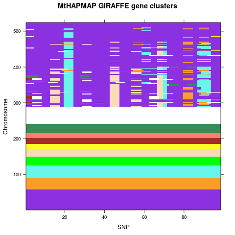

Identification of haplotype clusters for GIRAFFE gene in the Medicago HapMap
================================================================================

**Author:** John Stanton-Geddes

**Date:** 16 September 2014

## Summary

The goal of this bioinformatic analysis is to determine the number of haplotype clusters that exist for a heme oxygenase gene, Medtr8g019302.1, that was annotated in the Medicago truncatula 4.0 genome. This gene, named GIRAFFE, has been studied in the Harris lab as it has effects on plant development and nodulation[^1].

[^1] http://www.uvm.edu/~plantbio/harris.screen.php

## Data

First, I downloaded the file containing Mt4.0v1 annotation SNPs for chromosome 8 from the GWAS accessions (262) from the Medicago HapMap website (http://www.medicagohapmap.org/downloads/mt40). The SNP file is in the binary variant call format (BCF) described [here](http://www.1000genomes.org/wiki/analysis/variant-call-format/bcf-binary-vcf-version-2). I also downloaded the `bcf.csi` file which is needed for `bcftools` filtering of the file.

```{r setup}
library(stringr)
library(plyr)
library(knitr)

opts_chunk$set(cache=TRUE)
```

```{r download}
chr <- "8"
site.range <- "6779092-6783193"
datadir <- "data/"

file <- paste(datadir, "chr", chr, "-filtered-set-2014Apr15.bcf", sep="")

if(!file.exists(file)) {
    system('wget http://www.medicagohapmap.org/downloads/Mt40/snps_by_chr//chr8-filtered-set-2014Apr15.bcf')
    system('wget http://www.medicagohapmap.org/downloads/Mt40/snps_by_chr//chr8-filtered-set-2014Apr15.bcf.csi')
} else print("File already downloaded!")
```

Next, I used [bcftools](http://samtools.github.io/bcftools/) to extract SNPs from the region containing the GIRAFFE gene. This requires that bcftools are installed and available system-wide.

```{r txt_query}
txt.out <- paste(datadir, "chr", chr, "_", site.range, ".txt", sep="")
#system(paste('bcftools query -H -r chr', chr,':' , site.range," -f '%CHROM\t%POS[\t%TGT]\n' ", file, " > ", txt.out, sep=""))
```

Examination of this file revealed a number of SNPs that are heterozygous within accessions.

```{r snp_check}
haplo.data <- read.table(txt.out)
t.haplo.data <- t(haplo.data[,2:ncol(haplo.data)])
colnames(t.haplo.data) <- paste("snp", t.haplo.data[1,], sep="")
t.haplo.data <- t.haplo.data[-1,]

hz <- c("A/C", "A/G", "A/T", "C/A", "C/G", "C/T", "T/A", "T/C", "T/G")

t.haplo.data[which(t.haplo.data %in% hz)]

hz.pos <- which(t.haplo.data %in% hz)

hz.col <- as.integer(hz.pos/nrow(t.haplo.data))+1
hz.row <- hz.pos%%nrow(t.haplo.data)

# check
t.haplo.data[hz.row[1], hz.col[1]]
t.haplo.data[hz.row[5], hz.col[5]]
t.haplo.data[hz.row[10], hz.col[10]]
```

`r length(unique(hz.row))` accessions contain heterozygous SNPs, and `r length(unique(hz.row))` SNPs are heterozygous in at least one accession.

Are het SNPs clustered?

```{r het_cluster}
unique(hz.col)
```

Yes, appears to be a group from 150-165.

Are het SNPs the segregating alleles at that site, or rare polymorphism?

```{r het_SNPs}
for(i in 1:length(unique(hz.col))) print(unique(t.haplo.data[,unique(hz.col)[i]]))
```

For the first 5 and last 5 het SNPs, the het site is polymorphic for the segregating alleles at that site (e.g. possible SNPS are T/T, C/C, T/C) . For the middle 8 (interestingly, the ones that appeared clustered), the het site is unique (e.g. A/A, A/C). So it looks like some of both are going on.

Given this (unexpected) evidence for heterozygous sites, I phase the data prior to haplotype clustering. 


```{r vcf_query}
vcf.out <- paste(datadir, "chr", chr, "_", site.range, ".vcf", sep="")
system(paste('bcftools view -f PASS -r chr', chr,':' , site.range,' -O v -o ', vcf.out, " ", file, sep=""))
```

To identify haplotypes, I used the program [Beagle](http://faculty.washington.edu/browning/beagle/beagle.html). First, I had to convert the VCF file to BEAGLE format using `vcf2beagle` [utility program](http://faculty.washington.edu/browning/beagle_utilities/utilities.html#vcf2beagle).

```{r vcf2beagle, cache=TRUE}
beagle.out <- paste(datadir, "chr", chr, "_", site.range, sep="")
system(paste('cat ', vcf.out, ' | java -jar scripts/vcf2beagle.jar ? ', beagle.out, sep=""))
```

I ran BEAGLE on this file for haplotype imputation.

```{r beagle, cache=TRUE}
system(paste('java -Xmx1000m -jar scripts/beagle.jar unphased=', paste(beagle.out, ".bgl.gz", sep=""), ' missing=? out=imp', sep=""))
# extract file
system('mv imp* data/.')
system(paste('gunzip ', datadir, "imp.chr", chr, "_", site.range, ".bgl.gz.phased.gz", sep=""))
```

I loaded the imputed haplotypes file into R to determine how many unique haplotypes. First I had to filter out the non-variable site that were in the VCF files.

```{r load_hap}
giraffe.haps <- read.table(paste(datadir, "imp.chr", chr, "_", site.range, ".bgl.gz.phased", sep=""), colClasses="character")
colnames(giraffe.haps) <- giraffe.haps[1,]
rownames(giraffe.haps) <- giraffe.haps[,2]
giraffe.haps <- giraffe.haps[-1,-c(1:2)]

giraffe.haps2 <- matrix(nrow=0, ncol=ncol(giraffe.haps))
colnames(giraffe.haps2) <- colnames(giraffe.haps)

# filter out non-variable sites
rowiter <- 1
for(i in 1:nrow(giraffe.haps)) {
    tmp <- as.character(unlist(giraffe.haps[i,]))
    chars <- unique(tmp)
    if(length(chars)>1) {
      giraffe.haps2 <- rbind(giraffe.haps2, tmp)
      rownames(giraffe.haps2)[rowiter] <- rownames(giraffe.haps)[i]   
      rowiter <- rowiter + 1
      }
    }

dim(giraffe.haps2)

# tranpose
t.giraffe.haps <- t(giraffe.haps2)
t.giraffe.haps[1:5,1:8]
```


As a simple first pass of diversity in this gene, I determined the number of unique haplotypes.

```{r unique}
haps.even <- list()
haps.odd <- list()

for(i in 1:nrow(t.giraffe.haps)) {
    tmp <- paste(t.giraffe.haps[i,2:ncol(t.giraffe.haps)], collapse="")
    if(i%%2 == 0) haps.even <- c(haps.even, tmp) else {
        haps.odd <- c(haps.odd, tmp)
    }
}

length(haps.even)
length(haps.odd)

length(unique(haps.even))
length(unique(haps.odd))

haps <- c(haps.even, haps.odd)
length(unique(haps))
```

There are `r length(unique(haps))` unique haplotypes in the 262 samples (524 chromosomes).


I use the R code available from [HaploSuite](http://www.statgen.nus.edu.sg/~software/haplosuite.html) to cluster and visualize the haplotypes.
First, I format the data for use with `haplosim`, which requires filtering to bi-allelic SNPs and re-coding each SNP to 0/1.                                                                                                                                                                 
```{r haplosuite_format}
# convert to HapMap format
haplo.mat <- matrix(nrow=0, ncol=ncol(giraffe.haps2))

for(i in 1:nrow(giraffe.haps2)) {
    tmp <- as.character(unlist(giraffe.haps2[i,]))
    chars <- unique(tmp)
    if(length(chars)==2) {
        tmp[which(tmp==chars[1])] <- 0
        tmp[which(tmp==chars[2])] <- 1
        haplo.mat <- rbind(haplo.mat, as.numeric(tmp))
    }
}

haplo.mat <- as.data.frame(haplo.mat)
haplo.mat[1:10, 1:5]

position <- giraffe.haps[-1,2]
position <- str_split_fixed(position, ":", n=2)[,2]
```

With the formatted data, I now use the `haplosim` function to cluster haplotypes.


```{r haplosim}
# load functions
source("R/haplosim.R")

distance.measure="physical"

haplosim.out <- haplosim(t(haplo.mat), position, miss.code=9, snp.miss=NULL, focal=FALSE,
    focal.flag=NA, focal.weight=-1, distance.measure=distance.measure, n.hap="auto",
    tolerance=1, sticky=5)

names(haplosim.out)
table(haplosim.out$hap.group)
```

Haplotype clustering reveals 12 clusters, with most chromosomes unassigned (-1) and the other groups consisting of 12 to 58 chromosomes.

Next, I check to see if any of the accessions have chromosomes assigned to different haplotype clusters.

```{r mismatch}
h2 <- data.frame(
  HM = rep(colnames(giraffe.haps2)[seq(1, length(colnames(giraffe.haps2)), by=2)], each = 2),
  chrom = rep(c(1,2), times = length(haplosim.out$hap.group)/2),
  hap = haplosim.out$hap.group)

head(h2)

# find which accessions have chromosome assigned to different haplotype clusters
h2.mismatch <- ddply(h2, .(HM), summarize, eq = all.equal(hap[1], hap[2]))
                 
mismatch <- h2.mismatch[which(h2.mismatch$eq != "TRUE"), "HM"]

h2[which(h2$HM %in%  mismatch), ]
```

Only 4 accessions have chromosome with different haplotypes, and all of these consist of pairs that have one clustered chromosome paired with an unassigned chromosome. I can thus reduce the chromosomes to a single haplotype for each accession.

```{r accession_hap}
acc.hap <- data.frame(HM = levels(h2$HM), hap = NA)
  
for(i in levels(h2$HM)) {
  hm <- h2[which(h2$HM == i), ]
  if(hm$hap[1] == hm$hap[2]) 
    acc.hap[which(acc.hap$HM == i), "hap"] <- hm$hap[1] else {
      acc.hap[which(acc.hap$HM == i), "hap"] <- max(hm$hap)
    }
  }

table(acc.hap$hap)
```

```{r write, echo=FALSE}
# save results to csv grouped by haplotype cluster
write.table(acc.hap[order(acc.hap$hap, decreasing=TRUE),], file = paste("Mt-giraffe-haplotype-clusters-", Sys.Date(), ".csv", sep=""), quote=FALSE, sep=",", row.names=FALSE)
```


Next, I visualize these clusters using code provided from [HaploSuite](http://www.statgen.nus.edu.sg/~software/haplosuite.html). 


```{r hapvisual, eval=TRUE, echo=FALSE}
######################################################
### HAPVISUAL - METHOD FOR HAPLOTYPE VISUALIZATION ###
######################################################
# haplosim.out = output from haplosim
# k = number of subpopulations to split the input
# k.vis = which subpopulation to visualize
# k.flag = vector of integers from 1 to k, denoting the subpopulation membership of each chromosome, ignored if k = 1
# type = type of clustering to perform ("unsorted", "simple", "stepwise", "kmeans", "haplosim"), default to "haplosim"
# col = names of 2 colors corresponding to the two possible alleles, default at "yellow" and "green"
# col.haplosim = color palette corresponding to the numbers for haplosim cluster, currently using default colors up to 9 colors, with grey representing missing values. 
# title = names of subpopulations, must be of the same size as k, otherwise NULL

k = 1
k.vis = 1
k.flag = 1
type = "haplosim"
col = "default"
col.hap = "default"
title = "MtHAPMAP GIRAFFE gene clusters"

### 
require(lattice)
if (k == 1) k.vis <- 1	
n.snp <- haplosim.out$n.snp
if (col == "default") col <- c("yellow", "green")
if (col.hap == "default") col.hap <- colorRampPalette(c("grey", "BlueViolet", "orange", "cyan", "Green", "PeachPuff", "yellow", "brown", "salmon", "SeaGreen")[1:(haplosim.out$n.hap+1)], space = "Lab")
if (k == 1) k.flag <- rep(1, haplosim.out$n.chr); k.flag.sort <- k.flag
input.draw <- haplosim.out$unsorted
if (type == "unsorted") input.draw <- input.draw; k.flag.sort <- k.flag
if (type == "simple"){
   input.draw <- input.draw[haplosim.out$simple.ranking,]
   k.flag.sort <- k.flag[haplosim.out$simple.ranking]
}   
if (type == "stepwise"){
   input.draw[haplosim.out$stepwise.ranking,] <- input.draw
   k.flag.sort <- k.flag
   k.flag.sort[haplosim.out$stepwise.ranking] <- k.flag
}
if (type == "kmeans"){ 
   input.draw <- haplosim.out$kmeans.unsorted
   input.draw <- input.draw[haplosim.out$kmeans.ranking,]
   k.flag.sort <- k.flag[haplosim.out$kmeans.ranking]
}
if (type == "haplosim"){
   input.draw <- haplosim.out$haplosim.unsorted
   input.draw[haplosim.out$hap.ranking,] <- input.draw
   k.flag.sort <- k.flag
   k.flag.sort[haplosim.out$hap.ranking] <- k.flag
}
flag.k <- which(k.flag.sort == k.vis)
n.chr.k <- length(flag.k)
output.draw <- input.draw[flag.k,]
if (is.element(type, c("unsorted", "simple", "stepwise"))) levelplot(abs(c(unlist(output.draw))-0.001) ~ rep(1:n.snp, each = n.chr.k) + rep(1:n.chr.k, n.snp), at = seq(0, 1, length = 101), colorkey = F, col.regions = col, xlab = "SNP", ylab = "Chromosome", main = title[k.vis])

png("haplovisual.png")
if (is.element(type, c("kmeans", "haplosim"))) levelplot(abs(c(unlist(output.draw))-0.001) ~ rep(1:n.snp, each = n.chr.k) + rep(1:n.chr.k, n.snp), at = seq(0, haplosim.out$n.hap, length = 101), colorkey = F, col.regions = col.hap(100), xlab = "SNP", ylab = "Chromosome", main = title[k.vis])
dev.off()
print(paste("Separate chromosomes into ", k, " subpopulations...", sep=""));print(paste("Clustering haplotypes using method ", type, "...", sep=""));print(paste("Plotting clustering for subpopulation ", k.vis, " with ", n.chr.k, " chromosomes.", sep=""))
```


                                                                                                                                                                                                    
